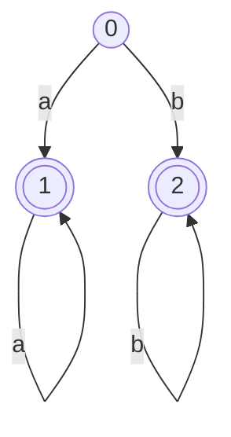

# autolex

Generate a lexer from an automaton.

## Usage

```bash
autolex <input file> <output file>
```

## Input file example



```yaml
initial:
0

terminals:
1 LIST_OF_A
2 LIST_OF_B

transitions:
0 1 push a
1 1 push a
0 2 push b
2 2 push b
```